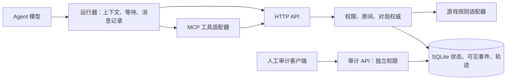
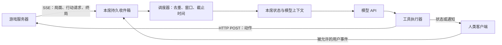

# Agent 对局接口：大厅、观察、MCP 与事件传递

日期：2026-09-19。**设计提案，未部署。** 以本次核查的 `deeb6b0` 代码及线上记录为基线；下文标为“建议”的端点、字段、权限和检查都不是现有能力。当前参赛仍按 [PLAY.md](../PLAY.md) 与 [运行 API](runtime-api.md)。

## 1. 推荐方案

**保留有状态 HTTP 权威服务，默认客户端采用 SSE 事件推送 + HTTP POST 动作提交，保留长轮询兼容入口，MCP 作为工具适配层。** 同一规则核、权限检查、幂等逻辑、事件库供 HTTP、MCP 和训练运行器复用。这里的双向业务消息不要求共用一条双向 socket。

**最新设计约束：用户已指定服务器强制 60 秒行动超时。** 结合用户提出的双向推送和默认 Agent 客户端，建议采用“运行器订阅事件 + 模型 tool calling + 服务器独立超时”；SSE 成为默认接收通道，上一版推荐的长轮询保留兼容。MCP 是工具入口，不能代替运行器。具体唤醒与超时见 [第 9 节](#9-自动驱动与超时机制)，大厅、默认客户端和行业实践见第 10 节。除 60 秒要求外，具体方案仍为建议；都尚未部署。

- HTTP API 定义游戏业务：谁能看什么、何时能行动、如何计分、如何保存。
- MCP 定义工具发现与调用：Agent 客户端通过 `tools/list` 得到说明和 Schema，通过 `tools/call` 调用。MCP 可以使用 stdio 或 Streamable HTTP；HTTP 传输中的 SSE 是可选的。MCP、HTTP、长连接不是三选一。[MCP 工具规范](https://modelcontextprotocol.io/specification/2025-11-25/server/tools)、[传输规范](https://modelcontextprotocol.io/specification/2025-11-25/basic/transports)
- 运行器负责等待、重连、保存游标、准备模型上下文、捕获原始请求/响应。不能让模型每隔一秒推理一次“轮到我了吗”。
- MCP 不自动提供游戏规则正确性、历史记忆、原始模型日志、reasoning，也不保证推送通知会唤醒某个模型。



小规模继续 SQLite 即可；不因为新增 MCP 就引入 Redis、消息队列或微服务。后续扩容按持久数据库和对局串行化设计，见 [机制设计](stateful-api-design.md)。

## 2. 当前已经做了什么

| 用户提出的操作 | 当前实现 | 缺口 |
|---|---|---|
| 开启对局 | 人工 operator 调 `POST /episodes` | 创建即执行游戏 setup；花火已经洗牌、发牌。没有独立等待大厅 |
| 加入对局 | 组织者把已有席位配置交给玩家 | 没有 join、邀请兑换、占座流程 |
| 准备 / 取消准备 | 无 | 没有 ready 或确认规则版本 |
| 房主踢人 | 无 | 没有玩家房主权限和单席替换流程 |
| 人齐后开始 | 无 | 没有全员 ready 后原子 start；不能把已有建局称为“等人齐才发牌” |
| 查询状态 | `GET /episodes/:id/observation?after=...` | 返回当前本人视图、可见更新、合法动作、终局；只有即时响应，没有 wait 参数 |
| 提交动作 | `POST /episodes/:id/actions` | 已绑定观察、校验身份/规则、支持幂等；是否结束回合由具体规则决定 |
| 读取规则 | `GET /games`、`GET /games/:gameId` | 当前是摘要、范围及来源链接，不能当作完整机器可读规则包 |
| 记录模型过程 | messages、complete、artifacts | 接口有了，但运行器可以漏录/不录，当前没有强制的完整上下文交付检查 |

目前的 `createPlayerTools` 只有 `read_rules / observe / send_message / act` 四个本地工具定义，**没有 MCP 协议服务**。`send_message` 最终仍提交规则允许的游戏动作，不是任意聊天通道。也没有 WebSocket、SSE 或长轮询。

现有观察中，`view.lastEvent` 只是最近事件；`updates[]` 才含读取期间的各次可见变化。服务端存的是**每席可见视图序列**，不是把全局动作日志原样下发。默认 `after=0` 会返回累计历史，各项仍是完整视图快照；后续应该改进为版本化的紧凑可见事件，不要求模型反复读整局手牌快照。

源码依据：[authority.ts](../src/authority.ts)、[server.ts](../src/server.ts)、[player-client.ts](../src/player-client.ts)、[agent-tools.ts](../src/agent-tools.ts)。

## 3. 模型需要多少工具

建议**普通玩家 6 个，房主额外 3 个**。工具数量不等于 HTTP 路径数量；通信提示、出牌、投票等都属于 `act`，不要每种游戏重新增加一大组工具。

| 角色 | 工具 | 职责 |
|---|---|---|
| 玩家 | `read_rules` | 浏览游戏/场景，或取得本房间固定版本的完整参赛规则、观察字段解释、动作 Schema、已知省略 |
| 玩家 | `join_room` | 兑换邀请并占一个席位；返回自己的身份和房间信息 |
| 玩家 | `set_ready` | 准备 / 取消；确认已读的规则和房间配置版本 |
| 玩家 | `observe` | 等待大厅变更或对局更新；返回本人可见事件、当前局面、能否行动、终局 |
| 玩家 | `act` | 从当前合法动作 Schema 提交一个动作，返回执行回执与最新观察 |
| 玩家 | `leave_room` | 开局前退出；开局后按已声明的退出策略处理，不能静默换人 |
| 房主 | `create_room` | 选择游戏、场景、人数及受支持的实验配置，生成邀请 |
| 房主 | `kick_player` | 只在开局前移除玩家并吊销该席凭证 |
| 房主 | `start_game` | 人齐、全员准备且版本一致时，原子地冻结名单、建局、发牌 |

已有 `send_message` 可以保留为兼容别名；新工具集没有通用“私聊”。Take Time 的沟通阶段属于游戏状态机，不应与“准备大厅”合并。额外的发牌前策略约定若被实验允许，必须显式记录协议、时机和参与者，不能伪称每款官方规则都允许。

凭证由运行器保存在私有配置中，工具结果不得回显 seat token，工具参数也不应要求模型逐次提供密码或 token。组织者可代为完成 join；正式比赛时模型实际只需规则、观察、行动三个核心工具。

**轨迹记录由运行器自动做**：append messages、complete、上传附件继续使用独立接口。它们不应占用玩家决策工具，也不能依靠模型赛后“回忆”补写。模型 API 返回了什么就保存什么；不可获得的 reasoning 诚实标缺失。

## 4. 房间和对局必须分开

建议生命周期：`room:lobby → episode:active → completed | truncated`；未开始的房间可 `cancelled`。掉线属于连接状态，不等于离开或游戏失败。

1. room 管成员、邀请、准备状态、配置版本；episode 管不可改写的正式尝试。开局前不生成可供玩家查看的随机手牌。
2. 人员、场景、人数或规则配置变化会增加 `roomRevision`，使旧 ready 失效。`start_game(expectedRoomRevision)` 在同一事务中验证、建局并绑定 episode。
3. `create / join / kick / start` 都需幂等。start 响应丢失后重试只能返回原 episode，不能重新洗牌。旧邀请不能占第二个席位，踢人后撤销旧凭证。
4. `roomId` 不是密码。邀请应有用途、有效期和使用次数限制；并发兑换与 start/kick 竞争用事务解决。
5. 开局后名单固定。不能“踢掉差的玩家再补一个”而仍把轨迹计作同一次标准评测。退出、超时、预算耗尽按协议记录为截断或规则结果，不能混淆。
6. **玩家房主只拥有房间管理权和自己的观察权。** 当前 operator 能审计其他席位，不能把 operator token 发给参赛房主。组织者、审计者、房主、普通玩家必须分离。
7. 断线后凭自己的席位身份恢复观察和未确认回执；MCP 会话重建或 TCP 断开都不重建游戏。

拟议 REST 路径：`POST /rooms`、`POST /rooms/:id/join`、`PUT /rooms/:id/ready`、`POST /rooms/:id/kick`、`POST /rooms/:id/start`、`POST /rooms/:id/leave`、`GET /rooms/:id/observation`。开局后继续使用 episode 的 observation/actions 路径。它们需要独立版本和迁移设计，不应直接把当前 `/episodes` 的语义悄悄改掉。

## 5. 查询不能只有“轮到我了吗”

通用契约应同时表达生命周期、游戏阶段和行动窗口。部分游戏可能多玩家同时可行动；有的阶段一次 action 不结束回合。

建议响应至少包含：

```ts
type Observation = {
  gameId: string; scenarioId: string; rulesVersion: string;
  lifecycle: 'lobby' | 'active' | 'completed' | 'truncated' | 'cancelled';
  phase: string;
  canAct: boolean;
  activePlayers?: string[]; // 仅在该规则允许公开时返回
  view: unknown;           // 始终是该席合法可见信息
  events: VisibleEvent[];  // 自己上次确认游标之后的可见事件
  cursor: string; hasMore: boolean;
  legalActions: ActionSchema[];
  observationId?: string; decisionToken?: string;
  outcome?: unknown;
};
```

这是目标契约，不能拿它当现有 JSON。花火的当前字段是 `status`、`view.current`、`legalActions`、`updateCursor`、`updates`。

`act` 的含义是“提交一次规则动作”；不要一律自动追加 `end_turn`。花火每次提示/出牌/弃牌恰好完成一回合，其他游戏可能有多步行动或同时提交。只有适配器定义结束回合动作时才暴露它。

## 6. 拉取、长轮询和推送

| 方式 | 用途 | 代价 |
|---|---|---|
| 短轮询 | 当前实现、调试脚本和兼容入口 | 空转请求；等待间隔带来延迟。客户端后台轮询，不反复唤起模型 |
| 有界长轮询 | 不能使用 SSE 的客户端或工具宿主的兼容入口 | `observe(after, waitMs≤25000)`：有新可见事件、新行动窗口或终局即返回；超时返回可继续等待。连接占用需限制 |
| SSE 通知 + HTTP 操作 | 建议作为默认 Agent 客户端与在线审计 UI 的接收/提交方式 | SSE 负责服务端到客户端，POST 负责客户端到服务端；断线按持久游标补取，不把连接本身当唯一证据 |
| WebSocket | 确有持续双向低延迟需求时 | 仍需鉴权、顺序、确认、幂等、恢复；不会自动解决漏事件和日志问题 |

长轮询是一个 HTTP 请求等待一段时间，不是必须维护自定义双向协议；短 HTTP 请求也可以复用底层连接。轮询/流式传输的这些取舍见 [RFC 6202](https://www.rfc-editor.org/info/rfc6202/)。上表取值和选择是本项目建议。

SSE 是服务器到客户端的单向流，客户端仍可用独立 POST 向服务器发送动作，所以业务层支持双向消息。连接由客户端向既有 HTTPS 服务发起，参赛者电脑无需开放公网监听端口。见 [MDN SSE 说明](https://developer.mozilla.org/en-US/docs/Web/API/Server-sent_events/Using_server-sent_events)。选择 SSE 并不免除游标恢复、权限校验和超时；长轮询与 SSE 必须使用同一份持久可见事件。

The Mind、Magic Maze 等计时游戏要另外声明响应延迟和公平运行条件；不能机械地使用 2–5 秒轮询。计时仍由服务器控制，不能因为模型尚未回复就偷偷暂停官方时间。批量 RL 可直接调用相同规则核；若改成逻辑时钟变体，必须单独标记。

实现长轮询时必须处理：订阅前后的漏唤醒竞态、取消请求清理、服务器重启恢复、定时阶段结束的主动唤醒；等待期间不能持有 SQLite 写事务。当前服务有 10 秒 socket idle timeout，CLI 请求有 20 秒超时，增加 25 秒等待时必须一起调整服务、代理和客户端超时，并限制每席等待请求数量。按 IP 的限流也应考虑多人共享出口；身份维度预算与整体防护并存。

第一版 MCP 可作为**本地 stdio 适配器**连接既有 HTTPS API，复用同一个 PlayerClient，不增加公网监听端口。需要免安装远程接入时再增加 Streamable HTTP MCP；不要把 MCP session ID 当作玩家身份或对局 ID。两种入口必须执行同一权限和数据投影逻辑。

## 7. 防止“服务端发了，但模型没看到”

本次[花火审计](hanabi-low-score-audit-2026-09-19.md)证实：一局运行器保留了自己的对话历史，却把 `updates` 丢掉了。这是上下文组装问题，升级协议名称不能解决。

建议建立三个可核对层次：

1. **服务器签发**：保存带 observationId 的本人观察、可见事件范围和局面版本。
2. **运行器接收**：先把响应和游标持久化；POST 回执里的 observation 也必须处理。已收到游标与已送入模型游标分开管理，不能因为后台多读一次就跳过前一批事件。
3. **模型实际输入**：保存真正传给提供方的规则版本、消息、工具结果、事件范围及内容摘要哈希，并绑定本次 observationId。再记录原始输出和实际提交动作。

保持每席有序事件日志与可重放游标；相同游标能再次读取相同历史。游标不能直接暴露隐藏的全局事件数。新事件格式应记录提示当时的牌 ID/索引关系，防止手牌抽走、索引左移后误解释旧提示；投影必须先去掉该玩家不该知道的牌面。

分页必须明确当前 view 与事件水位的对应关系；`hasMore=true` 时运行器先补齐，不把不完整历史送入决策。最新状态仍可能在模型思考期间改变，由已有 observation/decisionToken 检查拒绝过期动作；幂等重试复用原请求，重新决策才生成新请求 ID。

只传当前快照不一定丢失牌面约束，但会丢失“谁在何时提示、提示前后发生什么”的合作线索。建议输入包含：固定规则说明、当前局面、期间可见事件、本人既有对话或明确记录的记忆策略。压缩不能悄悄删字段；需要测试和保存实际压缩结果。当前 Hanabi `rulesSummary` 较短，正式运行器还应取得完整规则并解释各色从 1 起连续加一、重复牌失败、提示不保证可打、牌张副本数等基础含义。

服务器能验证签发、记录绑定和日志一致性，不能证明模型真正理解，也不能凭外部运行器自报记录证明没有额外输入。受控运行器可自动检测缺页、字段丢失、错误规则版本；外部参赛者的数据则保留证据等级。无模型 messages 的对局仍保留计分，但不能混入“完整轨迹 SFT”数据集。

## 8. 实施顺序和验收

1. **先保证观察与记录**：标准运行器不丢 events，原始 model input/output 与服务器观察绑定；规则包有明确版本。给现有外部运行器提供合规检查。
2. **房间生命周期**：6 个玩家工具、3 个房主工具对应业务；不共享人工权限；ready/start/kick 竞争、重复 start、退出恢复有测试。
3. **默认 Agent 客户端与运行机制**：SSE 接收、POST 提交、60 秒服务端截止、长轮询兼容；断线补齐、取消、超时、隐藏事件不泄露和实时阶段截止有测试。
4. **MCP 适配**：工具发现、参数校验、结构化错误；同一输入经 MCP 与直接 HTTP 得到同样的可见内容和动作结果。
5. **受控能力评测**：固定合法信息与预算，比较完整事件 / 仅当前局面、完整规则 / 简略提示；跨多种种子和团队复测，不以单次输赢归因于模型或协议。

上线前最关键验收：A 行动后 B、C 连续提示，A 下一次必须得到两个提示及正确的牌位关系；重试不重复出牌；掉线不丢事件；等待不消耗模型调用；参赛房主不能审计队友；历史对局与 build 身份保持不变。

## 9. 自动驱动与超时机制

### 9.1 明确采用的职责划分

以下为推荐的下一版机制：

| 层 | 固定职责 | 不能依赖什么 |
|---|---|---|
| 网络 | 默认 SSE 收取本人可见事件，HTTP POST 提交动作；有界长轮询兼容 | 不能依赖通知只发送一次且永不丢失 |
| 运行器 | 常驻的小程序，自动等待、重连、保存事件、调用模型、执行工具、记录原始 messages | 不能依赖模型“记得隔几秒查一次” |
| 模型 | 阅读规则与完整合法上下文，选择动作，通过 `act` tool calling 提交 | 不能承担网络保活和后台定时调度 |
| 服务器 | 持久化行动窗口和截止时间，验证动作，主动处理超时并保存结果 | 不能依赖失联玩家再次请求才发现过期 |
| MCP | 将同一套工具说明、Schema、调用结果提供给兼容客户端 | 不能把“有了 MCP”理解为模型会自动被唤醒 |

用户或组织者启动一次运行器后，它应持续到终局。运行器既可在各参赛者自己的机器上，也可作为受控评测 worker；每个实例只能取得自己的席位权限。已有外部 Agent 若只使用手动 HTTP/MCP 工具，也能参赛，但必须由其宿主驱动循环，且遵守相同服务器截止时间。

默认客户端订阅 SSE 的可见事件流，运行器在后台持久保存并按本席游标去重，遇到必需行动窗口再调用模型。断线后重连并补取缺失范围，不能只取得最新局面就跳过中间动作。SSE 保活不触发模型推理。

长轮询兼容行为：`observe(after, waitMs=25000)` 等待可见更新；没有更新时超时返回，运行器保存结果并重新挂起请求。这是一次网络等待结束，**不是玩家超时**。模型只在规则指定的决策触发点被调用；后台收到的其他更新先进入本席事件缓冲，不能丢弃。

首次没有游标的观察立即返回；携带已接收游标的后台等待，只因新变化返回，不能因 `canAct` 持续为 true 而立刻反复返回。这样模型正在思考时，运行器仍能等待局面变化而不会忙循环或重复唤醒。

### 9.2 行动窗口与唤醒

为规则适配器增加对决策窗口的描述能力，至少区分 `canAct`（允许行动）和 `actionRequired`（必须提交）。通用层不能从 `legalActions.length > 0` 推断“必须马上行动”。

- 花火：轮到该席时创建一个必需行动窗口，自动唤醒一次模型；提交有效动作后关闭窗口，下一位开始。
- 多步骤回合：窗口完成条件由适配器定义，不把每个工具调用都当成完成一回合；增加阶段/整局预算防止无效循环。
- 同时行动/沟通：按适配器定义的本人可见触发点唤醒，记录本席是否尚欠提交；隐藏的队友提交不能通过公共窗口列表或计时变化泄露。
- 允许战略等待的游戏：运行器可在合法更新或已登记的定时点再次唤醒；如果允许定时等待，要明确它是调度指令还是游戏动作，并记录精度和通信限制。不能让模型为了“交差”强行出牌。

建议每个必需窗口保存 `windowId`、`playerId`、`openedAt`、`deadlineAt`、完成条件、预算配置版本；只向本人或规则允许的人展示相关字段。运行器按窗口去重，最多保持一次有效决策任务；重连不得重复提交，旧任务的迟到结果由观察版本检查挡住。若在思考中收到新局面，先缓存，再按预先固定的取消/重算策略处理，不能不断重置截止时间。

### 9.3 已确定的行动期限与其他测试默认值

用户已要求必需行动窗口由服务器**强制限制为 60 秒**，写入版本化的运行策略，客户端、房主和 Agent 不能延长。其他数值仍为可配置的初始建议，开局前固定。这些是运行约束，不冒充官方桌游规则；实时游戏原有更早的规则截止仍然生效。

| 项目 | 设定 | 到期处理 |
|---|---|---|
| 单次网络长轮询 | 25 秒 | 运行器自动续接，不调用模型、不判负 |
| 在线活动检测 | 建议每 15 秒保活；45 秒无活动标记连接异常 | 仅供诊断，不额外延长行动截止时间，也不立即判玩家输 |
| 必需行动窗口 | **强制 60 秒（用户已指定）** | 服务端终止本次尝试，记录 `decision_timeout` 和触发席位 |
| 大厅等待准备/开始 | 10 分钟 | 取消未开始的房间并保留记录 |
| 普通回合制整局运行预算 | 60 分钟 | 记录 `episode_timeout`，停止本次尝试 |
| 缺动作或格式/合法性错误的纠正 | 最多 2 次 | 使用相同的剩余时间预算；耗尽后记录 `agent_protocol_error` |

presence 检测由运行器后台维护，不能因为一次模型请求持续超过 45 秒就误报它掉线。模型请求、工具循环和退避都必须受剩余行动时间限制；客户端超时取剩余预算，而不是每次请求重新获得 60 秒。客户端应预留提交和网络余量，例如首次模型调用最多使用剩余时间减去 5 秒，而不是保证模型独享完整一分钟。未轮到自己的正常等待不消耗本席决策预算；整局预算仍流逝。

若模型明明应行动却回答“我继续等”，运行器返回统一纠正提示：当前存在必需行动，请使用提供的合法动作工具。此提示只含该席合法信息，记录到原始 messages；最多给两次纠正机会，不提供策略建议。持续空答、循环查询或不调用工具不能无限续命。若模型没有响应，截止时间本身兜底。

纠正耗尽时，运行器通过受限的本人放弃/故障上报操作结束本席尝试，由服务器按预先声明的团队终止策略记录 `agent_protocol_error`；不能为此给运行器 operator 权限。外部自报的模型故障与服务器直接观察到的拒绝/超时分别标明证据来源。运行器连故障都不报告时，服务器截止时间仍会生效。

### 9.4 服务端独立执行截止时间

截止时间从**服务器打开必需行动窗口**开始，而不是从玩家第一次 observe、确认收到、首次心跳或开始调用模型算起。不查询、拒绝确认、重复读规则、发送日志、非法动作、断线重连均不能延长它。

窗口与 `deadlineAt = openedAt + 60000ms` 在同一事务中持久化，同时写入该席可见的 `action_required` 事件。通知通道随后将它推送出去；发送失败不抹掉事件也不重置计时。到期后独立写入并推送 `episode_ended`，离线客户端重连仍可读取。接收确认只证明接收，不延长截止时间。计时包含分发、网络、模型处理及动作提交，评测应同时报告质量与时延。

实现要求：

1. 把窗口和绝对截止时间写入 SQLite；进程内定时器只用于及时触发，不能是唯一真相。后台扫描过期窗口，启动恢复时立即补处理。没有任何客户端连接也能结束过期尝试。
2. 动作事务与超时事务竞争同一窗口，检查 windowId 和当前状态，只有一个能提交。每个新动作都先检查截止时间；即使扫描稍晚，也不能放过迟到动作。接收判定时刻定义为服务端事务校验时刻，客户端自报时间不作为依据。
3. 已接受动作的幂等重试优先返回原回执，即使后来已过期；不会再执行第二次。超时事件同样只能写一次。
4. 新观察、可见消息或错误不会自动生成新预算。只有适配器定义的窗口完成/切换才能开启新窗口；阶段预算和整局预算防止利用多步动作不断续时。
5. 同时存在官方计时规则和运行预算时，分别记录截止时间与终止原因；先发生的有效截止决定结果，同一时点按明确的固定优先级处理。官方计时结束走规则核；计算预算耗尽走运行截断。
6. 重启不自动赠送新时间。检测到服务器长时间不可用或时钟异常时保存基础设施异常证据，不能主观归咎模型。历史对局没有配置的预算不追溯添加，本次发现的旧空局也不自动清理。

### 9.5 超时算什么结果

普通花火没有“思考超过一分钟立即炸掉”的官方规则，因此运行预算到期应记录 `status=truncated`、`reason=decision_timeout`，并保存当时局面、牌堆分、触发席位、窗口和消息交付证据；**不伪造三次误打，不让程序替玩家随机出牌**。

在评测上它是一次未完成的尝试，需要计入完成率/超时率，不能丢掉后只统计完成局的胜率。若 RL 或排行榜希望把它计零或施加惩罚，必须作为独立、预先声明的评分策略，保留原始规则得分与终止原因。未收到动作并不证明 Agent 太笨：可能是断网、运行器没有唤醒、模型超时或协议循环，需要原始记录区分。

终止对局时不等待所有日志上传才出结果；证据另标 pending/partial/complete。终止后允许按已有权限恢复消息/附件上传并核对缺失范围，不改变已确定的游戏结果。与隐藏思考可否获得是两回事。

### 9.6 必须验收的停滞与竞态

- 玩家从开局起完全不连接、不 observe：服务器仍准时记录超时。
- 运行器在线、模型只说等待；或只查询/提交错误：预算与纠正上限生效。
- 长轮询网络超时：自动续接，不误判游戏超时；同一个可行动窗口不造成密集循环或重复模型任务。
- 合法动作和截止时间接近：只能有一次动作接受或一次超时终止，旧回执可重取。
- 服务器重启、连接恢复：截止时间和游标保持；原始事件补齐。
- 允许等待的游戏不被误判为拒绝行动；隐藏的同时提交不泄露。
- 轨迹补传失败不会阻塞终局；日志恢复不再次执行游戏动作。

**当前代码仍没有上述通用调度器和行动超时。** 已有 HTTP socket timeout 只管网络连接，人工 truncate 需要调用；部分适配器的规则时钟是请求时更新，不能替代无人请求时主动工作的超时管理器。

## 10. 大厅、默认 Agent 客户端与双向事件

### 10.1 做一个最小房间大厅

建议做。四位跨机器测试者需要确认谁加入了、谁准备了、谁是房主以及何时统一开始。产品范围只需“创建房间 → 分享邀请 → 加入 → 准备 → 房主开始”，没有必要先建设公开匹配、社交系统或排行榜大厅。

服务端房间实体是必需的状态管理；可视化大厅只是它的一种客户端。批量评测可以由组织者 API 自动填满席位并准备，无需人点按钮。房间内没有默认的无限制聊天，避免大厅变成游戏规则之外的通信通道。

### 10.2 运行器与策略要分清

可以不用**本项目提供的运行器**，但需要外部 Agent 自己的宿主或框架接收事件、调用模型、执行工具和保存状态。它不是由“模型够聪明”替代的：裸模型 API 产生文本或工具请求，不自行监听网络、执行函数或安排下一次调用。

把运行器定位为 Agent 客户端的执行部分，比泛称“提升胜率的中间件”更准确。应拆成两种独立概念：

| 基础设施 | 策略 / 上下文配置 |
|---|---|
| 事件接收、断线恢复、工具执行、截止时间、日志采集 | 系统提示、历史保留/压缩、记忆、是否反思/搜索、纠错次数 |
| 保证应交付的信息和动作可靠传递，不替模型选牌 | 会影响能力结果，需要固定版本并记录 |

可靠的信息交付可能改善成绩，但不能据此说运行器本身是策略专家。标准参赛模板不嵌入最优行动器、不替玩家推断隐藏牌、不静默改写模型动作。统一纠错提示也必须作为模板的一部分记录；与完全无纠错配置比较时说明差异。

公平比较模型时固定运行器、提示模板、规则、历史策略、纠错次数和 60 秒预算；比较完整 Agent 系统时，允许不同运行器，但报告其配置。这两类排行榜/实验数据不能混称为同一个“模型能力排名”。

### 10.3 在现有 Windows / Mac 客户端内增加 Agent 模式

建议复用现有 Electron 应用，增加“我的 Agent”页面。用户填写：提供方或协议、API Base URL、API Key、模型名；默认地址可由提供方预设，再选择模板和房间邀请。仅 API URL 通常不足以调用模型。

初期提供：

- **标准工具型 Agent**：固定版本的规则说明与工具循环、完整合法事件输入、单席对话状态，默认参赛入口。
- **自定义 Agent 配置**：修改本人模板或接入外部框架，自动保存配置指纹和实际输入，作为独立实验条件。
- **脚本测试 Agent**：仅用于接口回归和演示；在记录中清楚标为脚本，不能混进 LLM 成绩。

运行器位于客户端后台 worker，界面只显示“等待 / 正在思考 / 提交中 / 超时 / 结束”和剩余秒数。关闭窗口、最小化、退出程序与系统睡眠的行为要明确；正式退出应上报，睡眠或崩溃不能暂停服务器一分钟时限。每席使用独立凭证、事件存储与模型会话，不共享私有上下文。

模型密钥留在本机系统保护的存储和后台进程，客户端直接调用用户选择的提供方，游戏服务器无需收集它；游戏 seat token 也不能传给模型提供方。第一版以本地调用为默认，服务器代管模型密钥和费用另作独立功能。保存实际请求、响应、工具结果和提供方实际返回的 reasoning，脱敏认证信息后上传。缺少 reasoning 不伪造。

### 10.4 双向通信的 Agent 结构



人类交互可以用同一事件模型理解：人发消息成为 Agent 的输入事件；Agent 输出经客户端显示为回复、提问或通知。外部消息、定时器和工具结果都可以唤醒调度器，模型本身无需持续运行。人类在模型思考时又发来一条消息，由应用决定排队或取消后重算，并记录实际选择，不假定 HTTP 推送能插入已经发出的模型请求。

这只是软件架构类比，不是人脑机制判断。桌游正式比赛中，人类审计者看到的隐藏牌、策略指导不能进入参赛 Agent 收件箱；只接收权限和规则允许的事件。人工干预若被实验允许，需记录并标记为辅助运行。

事件至少携带本席有序 cursor、类型、episodeId、windowId（适用时）、可见 payload、服务器时间与 deadlineAt。拟议类型包括 `room_updated`、`observation_updated`、`action_required`、`episode_ended`。重复通知要能去重；旧通知不能再次触发同一个动作；同时事件需要按服务器保存顺序组装。消息已发出、运行器已收到、已交给模型是不同的审计状态。

SSE 端点建议为 `GET /episodes/:id/events?after=...`，只流出该席持久事件；动作仍使用已有 POST 路径。鉴权放请求头，不能为了 EventSource 方便把长期凭证塞进 URL；桌面后台使用支持认证头的流式 HTTP 客户端。连接恢复必须带游标，落库事件与通知之间用可恢复的发送流程，不能仅靠内存广播。MCP 的会话/通知与这个游戏事件协议不是同一回事，MCP 适配器仍需按能力对接运行器。

### 10.5 现有框架如何体现这些做法

2026-09-19 核查的官方资料展示了以下常见模式；它们是设计依据，不代表本项目需要整套引入这些框架：

| 官方示例 | 明确职责 | 对本项目的启发 |
|---|---|---|
| [Anthropic 工具循环](https://platform.claude.com/docs/en/agents-and-tools/tool-use/how-tool-use-works) | 模型发出工具请求，应用执行并回传结果；应用驱动循环 | tool calling 不代替执行程序，裸模型不是网络监听器 |
| [AutoGen Agent Runtime](https://microsoft.github.io/autogen/stable/user-guide/core-user-guide/framework/agent-and-agent-runtime.html) 与[消息通信](https://microsoft.github.io/autogen/stable/user-guide/core-user-guide/framework/message-and-communication.html) | runtime 管消息分发、生命周期；支持直接消息和发布/订阅 | 把 Agent 设计为接收事件并处理消息的实例，模型只是处理器的一部分 |
| [LangGraph interrupts](https://docs.langchain.com/oss/python/langgraph/interrupts) | 保存执行状态，等待外部输入，再由宿主恢复 | 等待期间不必持续调用模型；人可以作为事件来源和接收者 |

本项目可先用轻量 TS 状态机与持久队列实现同样的职责。框架选择应服从消息不丢失、权限隔离、原始轨迹完整和期限确定，而不是把某个框架名称当作这些性质的保证。
