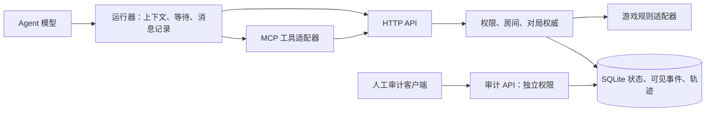

# Agent 对局接口：大厅、观察、MCP 与事件传递

日期：2026-09-19。**设计提案，未部署。** 以本次核查的 `deeb6b0` 代码及线上记录为基线；下文标为“建议”的端点、字段、权限和检查都不是现有能力。当前参赛仍按 [PLAY.md](../PLAY.md) 与 [运行 API](runtime-api.md)。

## 1. 推荐方案

**保留有状态 HTTP 权威服务，增加一个薄 MCP 适配层。Agent 默认拉取，运行器支持有界长轮询；推送作为可选加速。** 同一规则核、权限检查、幂等逻辑、事件库供 HTTP、MCP 和训练运行器复用。

- HTTP API 定义游戏业务：谁能看什么、何时能行动、如何计分、如何保存。
- MCP 定义工具发现与调用：Agent 客户端通过 `tools/list` 得到说明和 Schema，通过 `tools/call` 调用。MCP 可以使用 stdio 或 Streamable HTTP；HTTP 传输中的 SSE 是可选的。MCP、HTTP、长连接不是三选一。[MCP 工具规范](https://modelcontextprotocol.io/specification/2025-11-25/server/tools)、[传输规范](https://modelcontextprotocol.io/specification/2025-11-25/basic/transports)
- 运行器负责等待、重连、保存游标、准备模型上下文、捕获原始请求/响应。不能让模型每隔一秒推理一次“轮到我了吗”。
- MCP 不自动提供游戏规则正确性、历史记忆、原始模型日志、reasoning，也不保证推送通知会唤醒某个模型。



小规模继续 SQLite 即可；不因为新增 MCP 就引入 Redis、消息队列或微服务。后续扩容按持久数据库和对局串行化设计，见 [机制设计](stateful-api-design.md)。

## 2. 当前已经做了什么

| 用户提出的操作 | 当前实现 | 缺口 |
|---|---|---|
| 开启对局 | 人工 operator 调 `POST /episodes` | 创建即执行游戏 setup；花火已经洗牌、发牌。没有独立等待大厅 |
| 加入对局 | 组织者把已有席位配置交给玩家 | 没有 join、邀请兑换、占座流程 |
| 准备 / 取消准备 | 无 | 没有 ready 或确认规则版本 |
| 房主踢人 | 无 | 没有玩家房主权限和单席替换流程 |
| 人齐后开始 | 无 | 没有全员 ready 后原子 start；不能把已有建局称为“等人齐才发牌” |
| 查询状态 | `GET /episodes/:id/observation?after=...` | 返回当前本人视图、可见更新、合法动作、终局；只有即时响应，没有 wait 参数 |
| 提交动作 | `POST /episodes/:id/actions` | 已绑定观察、校验身份/规则、支持幂等；是否结束回合由具体规则决定 |
| 读取规则 | `GET /games`、`GET /games/:gameId` | 当前是摘要、范围及来源链接，不能当作完整机器可读规则包 |
| 记录模型过程 | messages、complete、artifacts | 接口有了，但运行器可以漏录/不录，当前没有强制的完整上下文交付检查 |

目前的 `createPlayerTools` 只有 `read_rules / observe / send_message / act` 四个本地工具定义，**没有 MCP 协议服务**。`send_message` 最终仍提交规则允许的游戏动作，不是任意聊天通道。也没有 WebSocket、SSE 或长轮询。

现有观察中，`view.lastEvent` 只是最近事件；`updates[]` 才含读取期间的各次可见变化。服务端存的是**每席可见视图序列**，不是把全局动作日志原样下发。默认 `after=0` 会返回累计历史，各项仍是完整视图快照；后续应该改进为版本化的紧凑可见事件，不要求模型反复读整局手牌快照。

源码依据：[authority.ts](../src/authority.ts)、[server.ts](../src/server.ts)、[player-client.ts](../src/player-client.ts)、[agent-tools.ts](../src/agent-tools.ts)。

## 3. 模型需要多少工具

建议**普通玩家 6 个，房主额外 3 个**。工具数量不等于 HTTP 路径数量；通信提示、出牌、投票等都属于 `act`，不要每种游戏重新增加一大组工具。

| 角色 | 工具 | 职责 |
|---|---|---|
| 玩家 | `read_rules` | 浏览游戏/场景，或取得本房间固定版本的完整参赛规则、观察字段解释、动作 Schema、已知省略 |
| 玩家 | `join_room` | 兑换邀请并占一个席位；返回自己的身份和房间信息 |
| 玩家 | `set_ready` | 准备 / 取消；确认已读的规则和房间配置版本 |
| 玩家 | `observe` | 等待大厅变更或对局更新；返回本人可见事件、当前局面、能否行动、终局 |
| 玩家 | `act` | 从当前合法动作 Schema 提交一个动作，返回执行回执与最新观察 |
| 玩家 | `leave_room` | 开局前退出；开局后按已声明的退出策略处理，不能静默换人 |
| 房主 | `create_room` | 选择游戏、场景、人数及受支持的实验配置，生成邀请 |
| 房主 | `kick_player` | 只在开局前移除玩家并吊销该席凭证 |
| 房主 | `start_game` | 人齐、全员准备且版本一致时，原子地冻结名单、建局、发牌 |

已有 `send_message` 可以保留为兼容别名；新工具集没有通用“私聊”。Take Time 的沟通阶段属于游戏状态机，不应与“准备大厅”合并。额外的发牌前策略约定若被实验允许，必须显式记录协议、时机和参与者，不能伪称每款官方规则都允许。

凭证由运行器保存在私有配置中，工具结果不得回显 seat token，工具参数也不应要求模型逐次提供密码或 token。组织者可代为完成 join；正式比赛时模型实际只需规则、观察、行动三个核心工具。

**轨迹记录由运行器自动做**：append messages、complete、上传附件继续使用独立接口。它们不应占用玩家决策工具，也不能依靠模型赛后“回忆”补写。模型 API 返回了什么就保存什么；不可获得的 reasoning 诚实标缺失。

## 4. 房间和对局必须分开

建议生命周期：`room:lobby → episode:active → completed | truncated`；未开始的房间可 `cancelled`。掉线属于连接状态，不等于离开或游戏失败。

1. room 管成员、邀请、准备状态、配置版本；episode 管不可改写的正式尝试。开局前不生成可供玩家查看的随机手牌。
2. 人员、场景、人数或规则配置变化会增加 `roomRevision`，使旧 ready 失效。`start_game(expectedRoomRevision)` 在同一事务中验证、建局并绑定 episode。
3. `create / join / kick / start` 都需幂等。start 响应丢失后重试只能返回原 episode，不能重新洗牌。旧邀请不能占第二个席位，踢人后撤销旧凭证。
4. `roomId` 不是密码。邀请应有用途、有效期和使用次数限制；并发兑换与 start/kick 竞争用事务解决。
5. 开局后名单固定。不能“踢掉差的玩家再补一个”而仍把轨迹计作同一次标准评测。退出、超时、预算耗尽按协议记录为截断或规则结果，不能混淆。
6. **玩家房主只拥有房间管理权和自己的观察权。** 当前 operator 能审计其他席位，不能把 operator token 发给参赛房主。组织者、审计者、房主、普通玩家必须分离。
7. 断线后凭自己的席位身份恢复观察和未确认回执；MCP 会话重建或 TCP 断开都不重建游戏。

拟议 REST 路径：`POST /rooms`、`POST /rooms/:id/join`、`PUT /rooms/:id/ready`、`POST /rooms/:id/kick`、`POST /rooms/:id/start`、`POST /rooms/:id/leave`、`GET /rooms/:id/observation`。开局后继续使用 episode 的 observation/actions 路径。它们需要独立版本和迁移设计，不应直接把当前 `/episodes` 的语义悄悄改掉。

## 5. 查询不能只有“轮到我了吗”

通用契约应同时表达生命周期、游戏阶段和行动窗口。部分游戏可能多玩家同时可行动；有的阶段一次 action 不结束回合。

建议响应至少包含：

```ts
type Observation = {
  gameId: string; scenarioId: string; rulesVersion: string;
  lifecycle: 'lobby' | 'active' | 'completed' | 'truncated' | 'cancelled';
  phase: string;
  canAct: boolean;
  activePlayers?: string[]; // 仅在该规则允许公开时返回
  view: unknown;           // 始终是该席合法可见信息
  events: VisibleEvent[];  // 自己上次确认游标之后的可见事件
  cursor: string; hasMore: boolean;
  legalActions: ActionSchema[];
  observationId?: string; decisionToken?: string;
  outcome?: unknown;
};
```

这是目标契约，不能拿它当现有 JSON。花火的当前字段是 `status`、`view.current`、`legalActions`、`updateCursor`、`updates`。

`act` 的含义是“提交一次规则动作”；不要一律自动追加 `end_turn`。花火每次提示/出牌/弃牌恰好完成一回合，其他游戏可能有多步行动或同时提交。只有适配器定义结束回合动作时才暴露它。

## 6. 拉取、长轮询和推送

| 方式 | 用途 | 代价 |
|---|---|---|
| 短轮询 | 目前 4 位测试者、调试脚本、普通回合制 | 空转请求；等待间隔带来延迟。客户端后台轮询，不反复唤起模型 |
| 有界长轮询 | 建议作为 Agent 默认等待方式 | `observe(after, waitMs≤25000)`：有可见事件、可行动或终局即返回；超时返回可继续等待。连接占用需限制 |
| SSE 通知 + HTTP 操作 | 后续实时审计 UI、大量在线 Agent | 单向通知足够；断线仍按持久游标补取，不把通知本身当唯一证据 |
| WebSocket | 确有持续双向低延迟需求时 | 仍需鉴权、顺序、确认、幂等、恢复；不会自动解决漏事件和日志问题 |

长轮询是一个 HTTP 请求等待一段时间，不是必须维护自定义双向协议；短 HTTP 请求也可以复用底层连接。轮询/流式传输的这些取舍见 [RFC 6202](https://www.rfc-editor.org/info/rfc6202/)。上表取值和选择是本项目建议。

The Mind、Magic Maze 等计时游戏要另外声明响应延迟和公平运行条件；不能机械地使用 2–5 秒轮询。计时仍由服务器控制，不能因为模型尚未回复就偷偷暂停官方时间。批量 RL 可直接调用相同规则核；若改成逻辑时钟变体，必须单独标记。

实现长轮询时必须处理：订阅前后的漏唤醒竞态、取消请求清理、服务器重启恢复、定时阶段结束的主动唤醒；等待期间不能持有 SQLite 写事务。当前服务有 10 秒 socket idle timeout，CLI 请求有 20 秒超时，增加 25 秒等待时必须一起调整服务、代理和客户端超时，并限制每席等待请求数量。按 IP 的限流也应考虑多人共享出口；身份维度预算与整体防护并存。

第一版 MCP 可作为**本地 stdio 适配器**连接既有 HTTPS API，复用同一个 PlayerClient，不增加公网监听端口。需要免安装远程接入时再增加 Streamable HTTP MCP；不要把 MCP session ID 当作玩家身份或对局 ID。两种入口必须执行同一权限和数据投影逻辑。

## 7. 防止“服务端发了，但模型没看到”

本次[花火审计](hanabi-low-score-audit-2026-09-19.md)证实：一局运行器保留了自己的对话历史，却把 `updates` 丢掉了。这是上下文组装问题，升级协议名称不能解决。

建议建立三个可核对层次：

1. **服务器签发**：保存带 observationId 的本人观察、可见事件范围和局面版本。
2. **运行器接收**：先把响应和游标持久化；POST 回执里的 observation 也必须处理。已收到游标与已送入模型游标分开管理，不能因为后台多读一次就跳过前一批事件。
3. **模型实际输入**：保存真正传给提供方的规则版本、消息、工具结果、事件范围及内容摘要哈希，并绑定本次 observationId。再记录原始输出和实际提交动作。

保持每席有序事件日志与可重放游标；相同游标能再次读取相同历史。游标不能直接暴露隐藏的全局事件数。新事件格式应记录提示当时的牌 ID/索引关系，防止手牌抽走、索引左移后误解释旧提示；投影必须先去掉该玩家不该知道的牌面。

分页必须明确当前 view 与事件水位的对应关系；`hasMore=true` 时运行器先补齐，不把不完整历史送入决策。最新状态仍可能在模型思考期间改变，由已有 observation/decisionToken 检查拒绝过期动作；幂等重试复用原请求，重新决策才生成新请求 ID。

只传当前快照不一定丢失牌面约束，但会丢失“谁在何时提示、提示前后发生什么”的合作线索。建议输入包含：固定规则说明、当前局面、期间可见事件、本人既有对话或明确记录的记忆策略。压缩不能悄悄删字段；需要测试和保存实际压缩结果。当前 Hanabi `rulesSummary` 较短，正式运行器还应取得完整规则并解释各色从 1 起连续加一、重复牌失败、提示不保证可打、牌张副本数等基础含义。

服务器能验证签发、记录绑定和日志一致性，不能证明模型真正理解，也不能凭外部运行器自报记录证明没有额外输入。受控运行器可自动检测缺页、字段丢失、错误规则版本；外部参赛者的数据则保留证据等级。无模型 messages 的对局仍保留计分，但不能混入“完整轨迹 SFT”数据集。

## 8. 实施顺序和验收

1. **先保证观察与记录**：标准运行器不丢 events，原始 model input/output 与服务器观察绑定；规则包有明确版本。给现有外部运行器提供合规检查。
2. **房间生命周期**：6 个玩家工具、3 个房主工具对应业务；不共享人工权限；ready/start/kick 竞争、重复 start、退出恢复有测试。
3. **MCP 适配**：工具发现、参数校验、结构化错误；同一输入经 MCP 与直接 HTTP 得到同样的可见内容和动作结果。
4. **等待优化**：长轮询及可选 SSE；断线补齐、取消、超时、隐藏事件不泄露和实时阶段截止有测试。
5. **受控能力评测**：固定合法信息与预算，比较完整事件 / 仅当前局面、完整规则 / 简略提示；跨多种种子和团队复测，不以单次输赢归因于模型或协议。

上线前最关键验收：A 行动后 B、C 连续提示，A 下一次必须得到两个提示及正确的牌位关系；重试不重复出牌；掉线不丢事件；等待不消耗模型调用；参赛房主不能审计队友；历史对局与 build 身份保持不变。
