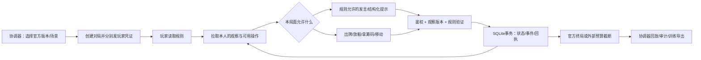

# 可运行的统一环境与 API

**0.8.0 新增**：邀请制房间、准备与原子开局、单席 SSE 和持久必需行动期限，见 [房间与事件协议](player-sessions.md)。已有下列 API 保持兼容。源码已实现，生产服务本次未部署；不能假定旧公网入口已经有 `/rooms` 或 `/events`。

**参赛 Agent 从 [PLAY.md](../PLAY.md) 开始。** 当前提供 HTTPS JSON API、模型无关工具封装和命令行助手，尚未实现标准 MCP 协议。远程玩家无需启动本地服务；只用组织者分发的本席配置。

**比赛中的模型消息接口**：`POST/GET /episodes/:id/messages` 由本座位持续记录/读取私有模型请求、响应和工具结果；`POST /episodes/:id/messages/complete` 终局封存；`GET /rollouts/:id/messages` 供人类逐玩家分页审阅。reasoning 原文、摘要、usage 与不可读字段分别标注。见 [完整协议及运行器接入](agent-messages.md)。

实现日期：2026-09-16；接入说明更新：2026-09-18。本文描述已经落地的接口；[V2 架构设计](stateful-api-design.md)还包含尚未实现的分布式扩展，不能把两者混为一谈。

## 1. 共用调用流程，不共用虚构的游戏阶段



玩家使用 `read_rules`、`observe`、`send_message`、`act`，赛后可用 `reflect` 提交本人的反思。其中 `send_message` 仍调用规则引擎的正常动作入口，不能绕过禁言。

赛后还可上传完整 Agent 运行文件和附件；使用相同 seat token，按 32 KiB 分块持久化到 SQLite，完整校验后可在人类审计台下载。轨迹与附件均不自动过期，达到容量预算也不会删除旧局。详见 [长期保存及原始轨迹上传接口](agent-artifacts.md)。Token 用量和实际返回的 reasoning 内容可以保存，模型没有返回的私有推理不会被生成或重建。

| 游戏 | 沟通/协调窗口 | 行动顺序 |
|---|---|---|
| Take Time 1-1 | 发牌背后可讨论；自己 `look_hand` 后禁言 | 所有人看完，任意人先放，然后顺时针 |
| Sky Team YUL | 每轮掷骰前讨论；掷骰后静默 | 放骰交替；共享重掷有双方独立选择 |
| The Crew 两作 | 不提供随意聊天；任务分配、求救投票/密封换牌、规定声纳提示 | 出牌跟随领墩者；提示者不被硬塞进出牌轮序 |
| Bomb Busters Mission 1 | 初始提示、规定剪线声明与回应；自由讨论不能泄露私有线值 | 顺时针剪线；双探测器需要目标玩家选择对应回应 |
| Hanabi | 颜色/数字提示；不提供自由聊天 | 仅当前玩家出牌/弃牌/提示；固定槽位，不支持 `reorder`；牌离手后补位，新摸牌追加末尾 |
| The Gang | 允许谈公开信息；不能泄露私牌 | 任意玩家拿/放筹码；全员拿好立即进入下一轮 |
| The Mind | 专注、暂停、共同同意飞镖；无任意聊天 | 无固定轮序，真实到达顺序决定先后 |
| The Game | 允许交流，但不能报具体牌值 | 协商先手后顺时针；一回合可放多张，再结束摸牌 |
| Magic Maze 指定 PnP 版 | 按该版准备/沙漏翻转窗口和提示棋子规则 | 实时共享棋盘，权限分散；系统时钟独立于动作 |

“讨论十句”和“每人一次工具调用算一回合”都只是某些训练调度器的预算，**不是通用官方规则**。有些游戏没有统一的开局讨论阶段。规则书可以随时读取，但读取规则不会揭开自己的牌；Take Time 看牌必须显式行动。

## 2. 运行与交互

当前 0.7.1 桌面应用默认连接远程 API，不启动本机游戏服务器，也不需要另外安装 Node。使用方法见[桌面客户端说明](desktop-client.md)。`--local` 保留可选单机模式；[单机应用说明](local-app.md)记录该模式。以下启动命令仅供需要自己运行本机服务的开发者。

开发或无窗口运行需要 Node.js 24+；当前本机服务使用已更新的 **24.21.0**。无需模型 API 密钥和运行时 npm 依赖：

```powershell
cd 'C:\Users\xuefe\Documents\chatgpt pro deep research\coop-bench'
npm test
npm run smoke
npm start
```

打开 `http://127.0.0.1:8788`，主页是人工 rollout 审计界面：选择历史对局、按时间线查看各玩家的已记录视角、沟通、出牌、决策摘要和审阅备注。凭证只保存在页面内存中；退出会清除页面中的凭证和轨迹缓存。

`/play` 保留原研究控制台，可创建对局、复制分开的玩家凭证、拉取某一玩家视图、按动作 JSON 提交。规则、来源与遗漏范围也在页面中。`重试上次请求` 复用原请求 ID 和内容。

API 只监听 `127.0.0.1`。桌面应用自动启动 API 并连接控制台，优先使用 8788，冲突时改用空闲端口。无窗口入口严格使用指定端口。启动日志只说明凭证位置，**不输出 token 值**。

可用 `COOP_ADMIN_TOKEN` 指定本机协调者凭证（24–256 个兼容 Bearer 的字符，支持 base64/base64url）、`COOP_DB` 指定数据库、`COOP_DATA_DIR` 指定数据目录、`PORT` 改端口。默认 SQLite 位于当前用户应用数据目录。未显式指定时，协调者 token 自动生成一次，保存到数据目录内的 `coordinator-token`；重启保留对局和凭证。一个数据目录仅允许一个 API 实例。

`COOP_USERS_FILE` 指定独立用户配置，默认读取数据目录的 `access-users.json`。`COOP_TRUSTED_PROXY_ORIGIN` 指定唯一、完整的 HTTPS 代理 origin；不能含通配符、路径、额外端口或 IP 地址。启用后整个 HTTP 服务禁止使用 coordinator 主凭证，主机所有者也使用独立 operator 凭证。配置不会自动开放端口或创建 HTTPS 代理，部署分别见 [腾讯云](cloud-deployment.md) 与 [私有组网](private-sharing.md)。

### 人工访问与玩家身份

| 身份 | 能做什么 |
| --- | --- |
| coordinator | 未启用共享时的本机管理凭证；可创建、终止、审计、导出和重放 |
| operator | 独立、可过期和吊销的实验组织者凭证；可管理与审计团队的全部对局，包括进行中轨迹 |
| auditor | 查看对局列表、审计已结束对局、添加 review；不能创建/终止对局或调用特权训练导出 |
| seat token | 只对应一局中的一个玩家；观察、行动、提交本人的赛后反思 |

operator 是可信实验组织者，不是隐藏信息游戏中的普通玩家。当前用户权限属于同一测试团队，没有逐用户的对局所有权隔离。agent 始终使用独立 seat token。

`scripts/manage-access.mjs` 管理人工用户，服务端只保存凭证摘要。`add` 默认有效期 30 天，`revoke` 对后续请求立即生效；创建命令把凭证写入显式指定的新文件，不打印凭证值。完整命令见上述共享部署文档。

### HTTP 端点

推荐前缀 **`/api/v1`**，也接受 `/api` 和无前缀旧地址。下表省略前缀；例如 `GET http://127.0.0.1:8788/api/v1/games`。桌面界面可复制实际 API 地址和单个玩家连接配置。

| 方法与路径 | 权限 | 作用 |
|---|---|---|
| `GET /games` | 公开 | 仅列出可实际创建的游戏、场景、人数、来源 |
| `GET /games/:gameId` | 公开 | 规则摘要、动作范围与局限 |
| `GET /identity` | 人工凭证 | 当前 id、role、local/proxy 入口、长期保留策略及容量使用量 |
| `GET /rollouts` | 人工凭证 | 分页对局摘要；支持 limit、offset、status、gameId |
| `GET /rollouts/:id` | 人工凭证；auditor 仅终局后 | 服务器保存的逐事件玩家视角和审阅备注 |
| `POST /rollouts/:id/annotations` | 人工凭证；auditor 仅终局后添加 review | 添加 review/reflection；提交者来源由服务器记录 |
| `POST /episodes` | coordinator / operator | 创建官方场景，返回每座位独立 token |
| `GET /episodes/:id/observation?after=<cursor>` | 该局某玩家 | 本人视图、上次读取后的可见变化、当前动作 schema、decision token |
| `POST /episodes/:id/actions` | 该局某玩家 | 提交动作或规则允许的消息 |
| `POST /episodes/:id/reflections` | 该局某玩家，终局后 | 提交 `{ "text": "..." }`，玩家身份由 seat token 决定 |
| `POST /episodes/:id/artifacts` | 该局某玩家，终局后 | 幂等创建原始轨迹或附件 manifest |
| `POST /episodes/:id/artifacts/:artifactId/chunks` | 同一上传玩家，终局后 | 持久保存一个 Base64 分块；相同重试幂等 |
| `POST /episodes/:id/artifacts/:artifactId/complete` | 同一上传玩家，终局后 | 校验总长度与 SHA-256，成功后封存 |
| `GET /episodes/:id/artifacts` | 该局某玩家 | 本人附件及缺失块，支持跨构建恢复 |
| `GET /episodes/:id/artifacts/:artifactId/content` | 同一上传玩家 | 下载完整附件原始字节 |
| `GET /rollouts/:id/artifacts` | 人工凭证；auditor 仅终局 | 所有玩家附件元数据 |
| `GET /rollouts/:id/artifacts/:artifactId/content` | 人工凭证；auditor 仅终局 | 安全附件下载，不执行上传的 HTML |
| `POST /episodes/:id/truncate` | coordinator / operator | 预算/人工停止；不算官方失败 |
| `GET /episodes/:id/audit` | coordinator / operator，终局后 | 带种子与真实状态的特权完整记录 |
| `GET /episodes/:id/replay` | coordinator / operator，终局后 | 从种子和事件逐步重放，比较全部状态摘要 |
| `GET /episodes/:id/training` | coordinator / operator，终局后 | 本人观察→动作数据及独立终局标签 |

鉴权为 `Authorization: Bearer <token>`。人工凭证和玩家凭证不能互换；配置共享后 coordinator 不能用于任何需要人工鉴权的路由。公开规则可匿名读取。HTTP 创建不接受客户端给的 `seed`，随机种子留在服务端；可信本地 runner/测试才可以指定种子。

创建示例（协调者）：

```json
{"gameId":"crew-deep-sea","playerCount":3,"scenarioId":"official-promo-1"}
```

动作示例（玩家，假设当前允许此动作）：

```http
POST /episodes/<episodeId>/actions
Authorization: Bearer <oneSeatToken>
Content-Type: application/json
Idempotency-Key: p1-action-0001
```

```json
{
  "observationId": "由 observe 返回",
  "decisionToken": "由 observe 返回",
  "action": {"type":"distress_vote","direction":"none"},
  "decisionSummary": "可选：本次决策的简短理由，仅进入私有审计"
}
```

`decisionSummary` 是玩家主动提供的摘要，不是模型隐藏思维链，也不发给队友。其他动作参数要使用 **当前** `legalActions` 的 schema；合法操作可以造成失败，例如 Hanabi 打错牌。接口不会仅列出“必定成功”的动作。

观察的 `updates` 保存自本人 `updateCursor` 之后每次可见变化的视图，按本人的序号排列。下次拉取带上返回的 `updateCursor`；省略 `after` 从开局开始读取。SDK 自动维护游标。这样即便没轮到自己、期间别人连续操作，也不会漏掉 Crew 上一墩或 Bomb Busters 一次性口头提示。更新是按本人视图投影产生的，不是把他人私有动作直接广播；隐形提交不会增加别人的游标。重复请求同一个游标仍能取得相同更新，不会因为一次响应丢失就永久漏掉信息。

**相同观察会去重。** 同一玩家的可见内容、决定版本和更新窗口相同时，返回同一份持久化观察及 `observationId`，重启后仍可复用。新的内容或窗口保留独立观察；出牌仍精确绑定它使用的观察。`issued_at` 表示这份观察最初签发的时间，不再把无变化的每次轮询保存为一条新观察记录。

## 3. 有状态、安全隔离与重试

SQLite 保存真实对局状态、玩家 token 的哈希、每人观察版本、发出的观察、已接受/拒绝的命令及幂等回执。**并非把状态放进 HTTP 连接**；任何工作进程拿相同数据库都能读取同一对局。当前部署是本地 SQLite，尚不是多机横向扩容的数据库方案。

写请求使用 `BEGIN IMMEDIATE`。顺序是鉴权 → 查幂等回执 → 推进官方时钟（若有）→ 检查本人观察版本 → 执行规则 → 更新状态/视图/事件/回执 → 提交事务 → 发响应。中途失败回滚。无效动作不移动牌，也不消耗决定版本；官方真实时间仍正常经过。

- 同一玩家、同一请求 ID、相同请求内容：返回原来的完整回执，**即便现在已经是旧局面**。超时后可以安全重试。
- 同一请求 ID 换内容：冲突；旧观察发新操作：409，需要重读，并用新请求 ID 提交新的决定。
- 玩家 ID 由凭证确定，不接受调用者冒充队友。
- 不提供全员原始动作 feed。Crew 求救时私下选择的卡不会被动作日志广播。
- 观察 token 依据**该玩家可见信息**更新，不暴露全局事件序号。其他人的密封提交若不可见，不改变本人的 token。
- 实时时钟只省略纯倒计时数值对决定版本的影响，棋盘/权限/终局变化仍使版本失效。
- SQLite、种子、审计文件及协调者 token 不能放进玩家提示或提供给玩家文件工具。同一 OS 用户的本地文件访问不构成安全沙箱。

这里解决的是状态隔离和协议正确性。研究 agent 的访问面应只有其工具闭包或自己的 HTTP 凭证；不能让三个玩家共享全局提示、全量回放或公共 scratchpad。

### 请求和存储预算

| 策略 | 当前默认值 |
| --- | --- |
| JSON 请求 | 64 KiB，最大深度 32，最多 8,192 个节点；拒绝无效 UTF-8、非有限数值、保留键与压缩体 |
| HTTP 总量预算 | 突发 200 次，以每分钟 600 次补充 |
| 每凭证预算 | 突发 60 次，以每分钟 180 次补充 |
| 每凭证高成本预算 | 突发 8 次，以每分钟 20 次补充；创建、完整 rollout、审计/训练导出、重放共同使用 |
| 对局数量 | 最多保存 1,000 局，其中同时进行中最多 32 局 |
| 每局命令 / 事件 | 1,000 / 2,500；拒绝命令也计入 |
| 每座位不同观察 | 2,000 份 |
| 持久化业务内容 | 每局 64 MiB，总计 512 MiB |
| 备注与反思 | 每局最多 100 条备注、每座位最多 20 条本人反思；每局文字合计最多 256 KiB；单条仍限制 20,000 字符 |

超出请求速率返回 HTTP 429 `RATE_LIMITED`；持久化或数量配额返回 HTTP 429 `RESOURCE_LIMIT`。资源拒绝回滚本次新写入，已提交的幂等回执仍可读取。后者不能单靠等待解决：主机所有者应整理数据或调整预算；没有自动清理历史记录的 HTTP 接口。

这些上限是运行策略，不影响官方胜负规则。预算耗尽后组织者可调用 `truncate`，服务为这个单次终止标记保留例外；该局标为截断，训练回报为 null。字节预算统计存储的 UTF-8 业务内容，未包含 SQLite 页、索引和 WAL 的全部磁盘开销。

嵌入者可通过 `new Authority(path, adapters, build, clock, limits)` 第五个参数调整持久化预算，通过 `createApi(authority, token, { ratePolicy })` 调整 HTTP 预算。当前启动命令没有把所有预算暴露为环境变量；不能从玩家请求改变预算。修改后应重跑相关安全测试。

## 4. 实时游戏的时间

`advanceTime(state, elapsedMs)` 是**系统专用**的确定性输入。HTTP 服务依据持久化检查点计算真实经过时间，在读取/动作前推进；进程关闭的时间也会计入。客户端不能指定 elapsedMs。到期在下一次请求时物化为终局，迟到的行动不能抢在到期前生效；当前没有主动 WebSocket 倒计时推送。

`decisionContext` 保留棋盘和行动权限，允许纯倒计时变化不让所有飞行中的请求立即过期。重放使用已记录的 elapsed 事件，不再次读取现实时间。

本地加速训练若主动注入逻辑时间，必须标记为该 runner 的时间模型。The Mind 依赖等待和默契，即便规则核是正确的，顺序循环调用、固定延时或读取全体手牌后选最小值也不能称为合法人类式策略评估。`smoke` 只检验环境能运行。

## 5. RLVR、SFT 与审计

终局区分 `win`、`loss`、`score-only`；外部取消或组织者因预算耗尽调用 `truncate` 时标为 `truncated`。单次配额拒绝不会自动结束对局。Hanabi 普通计分局不会被伪造为“低于 20 分即失败”。默认回报：胜负游戏终局 1/0，纯计分终局 score/maxScore，截断没有伪造回报。

HTTP `/training` 导出实际发给本人的观察和动作，`resultObservation` 是**本次动作刚结束**的观察。它未必是下一次轮到自己的观察；训练器必须按选用的时间粒度连接轨迹。终局团队回报单独作为 episode label，不能误当每步都得一次奖励。拒绝动作留在审计中，默认不进入 SFT。

本地 runner 的导出约定另见 [local-runner.md](local-runner.md)。两种导出格式有独立名称，不能在字段语义不同的情况下拼接。

同一个根种子的所有派生配置、人数和场景保守地归于同一个 `partitionFamily`，不能分别进训练与测试。这会合并部分其实独立的样本，但能防止换个场景 ID 就把相同发牌分到两侧。输出日志是可验证轨迹，**不是自动筛选过的专家示范**。SFT 可保留成功且无违规的局、人工评价或经复核的示范；输局可用于反思训练，但反思不能混入原决策时的输入。

审计材料包含：去重后观察的初次签发时间与内容、操作接收时间、讨论/提示原文、操作是否接受、规则结果、可选决策摘要、种子与确定性重放。逐事件 `observed` 保存该动作绑定的玩家输入；`views` 保存当时可见状态的投影。服务器能证明准备或签发过什么，不能证明客户端实际收到了或读懂了什么。赛后反思需分别评价“按当时信息是否合理”和“事后实际是否成功”。

Sky Team 的讨论是否编码骰值、The Gang / The Game / Bomb Busters 的自然语言是否变相泄露私有牌面、The Mind 是否暗自计数，不能靠数值胜负验证器自动证明。`implementation.verifier = objective-only` 明确标记这类限制；不能直接把一局成功说成“完整官方沟通规则也全部通过硬验证”。

## 6. 已实现与设计边界

已实现：确定性规则适配器、每座位观察、Schema 操作说明、SQLite事务、幂等重试、过期观察检查、观察去重、重启恢复、真实时间输入、终局回放、持久化 rollout 与人工审计前端、SFT轨迹、模型无关工具闭包、本地 runner、独立人工凭证及角色、人工凭证过期/吊销、[人工密码登录与短期会话](human-auth.md)、HTTP 限流与存储预算。

未实现：标准 MCP 协议适配、多机共享 SQL/actor 分片、Redis缓存、推送订阅、自助注册/邀请、每个 seat token 的单独吊销与轮换、多租户对局隔离、自动归档清理、完整训练作业/优化器、SFT质量筛选、未录入的官方扩展/战役。代码更新后旧局以 build 摘要拒绝静默续玩，尚无跨版本状态迁移器；已保存历史轨迹可以跨版本阅读，确定性重放需要相同引擎构建。

新增游戏只需实现 [GameAdapter](../src/types.ts)，把通过来源核查和测试的 adapter 加入注册表。**只有改动胜负、可见性或时序的新规则才需要改游戏核；HTTP鉴权、存储、重试、审计和导出都复用。**
